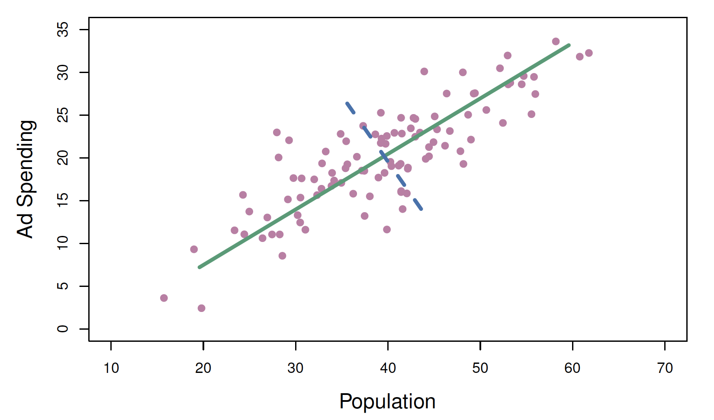
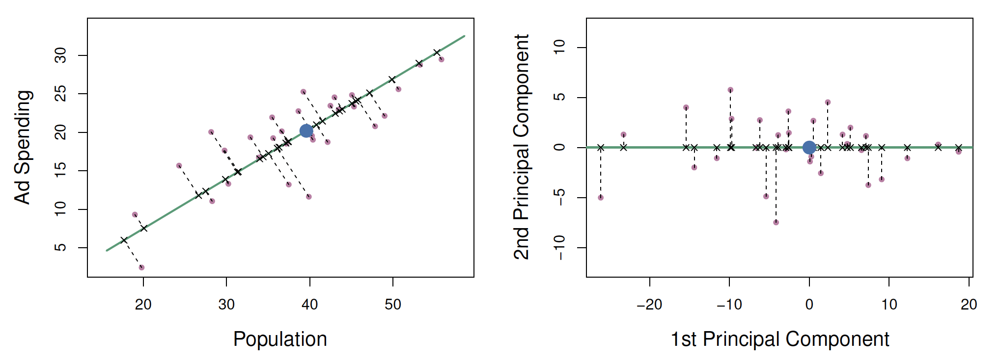

## Setup

```{r, echo = T, message = FALSE, warning = FALSE}
library(tidyverse)
library(tidymodels)
library(ISLR2)
library(learntidymodels)
#install.packages('pak')
#pak::pak("mixOmics") #Very large!

```

## Dimension Reduction

- Lasso does dimension reduction when fitting

- The methods that we have discussed so far in this chapter
have involved fitting linear regression models, via least
squares or a shrunken approach, using the original
predictors, $X_1$,$X_2$,...,$X_p$.

- Next we cover a few approaches that transform the
predictors and then fit a least squares model using the
transformed variables. We will refer to these techniques as
dimension reduction methods.

## The Transformations {.smaller}

- Let $Z_1,...,Z_m$ represent $M<p$ _linear combinations_ of our original $p$ predictors. Or, $$Z_m = \sum_{j=1}^p\phi_{mj}X_j$$ for some constants $\phi_{m1},...,\phi_{mp}$. 

- We can then fit linear regression model, $$y_i = \theta_0 + \sum_{m=1}^M\theta_mz_{im}+\epsilon_i\text{, }i=1,...,n,$$ using ordinary least squares. 


## The Coefficients {.smaller}

- Note that in our transformed model, the regression coefficients are given by $\theta_0...\theta_M$. 

- If the constants $\phi_{m1},...,\phi_{mp}$ are chosen well, then this dimension reduction can often outperform OLS regression. 

- Also note, that $\beta_j = \sum_{m=1}^M\theta_m\phi_{mf}$, and thus this new transformed model is a special case of OLS

- This effectively constrains the $\beta_j$'s. 

# Principal Componets Regression

## Principal Components Regression {.smaller}

- Here we apply principal components analysis (PCA)
(discussed in Chapter 10 of the text) to define the linear combinations of the predictors, for use in our regression.

- The first principal component is that (normalized) linear combination of the variables with the largest variance.

- The second principal component has largest variance,
subject to being uncorrelated with the first. And so on.

- Hence with many correlated original variables, we replace them with a small set of principal components that capture their joint variation.

## PCR - How does it work?

Video

<https://www.youtube.com/watch?v=SWfucxnOF8c>

## PCR - An Example {.smaller}

{width="50%"}

The first component in Green in the direction of the greatest variance.

## PCR - An Example {.smaller}

{width="50%"}

- The observations are project onto the green first component line on the left. This projection yields observations of the largest possible variance. 

- After accounting for this direction, we can consider the points on as if they are on an $x$-axis. Then second component will be chosen to minimize the variance in the last remaining direction. 

- The blue dot represents $(\bar{pop},\bar{ad})$

## PCR - An Example - Notation {.smaller}

- $Z_1 = 0.839 \times (pop - \bar{pop}) + 0.544 \times (ad-\bar{ad})$
- $\phi_{11}=0.839$ and $\phi_{21} = 0.544$, the **principal component loading's**
- Out of every possible linear combination of $pop$ and $ad$, such that $\phi_{11}^2 + \phi_{21}^2 = 1$, this linear combination has the highest possible variance. 
- Since $n=100$ and $pop$ and $ad$ are vectors of length 100, so is $Z_1$
    - $z_{i1} = 0.839 \times (pop_i - \bar{pop}) + 0.544 \times (ad_i-\bar{ad})$
- The $z_{11},...,z_{n1}$ are the **principal component scores**

## PCR - Another Interpretation {.smaller}

- The first component is as close to the data as possible (just like least squares)
- In the previous graph, when the distances from each point to the green "x-axis" line, are the principal component scores
- Each $Z_i$ will orthogonal (perpendicular) than the prior
- Each $Z_i$ will carry less information (variance) than the prior
- Each $Z_i$ will be uncorrelated with the prior $Z_i$


# Partial Least Squares

## Partial Least Squares {.smaller}

- PCR identifies linear combinations, or directions, that best
represent the predictors $X_1,...X_p$

- These directions are identified in an unsupervised way, since
the response Y is not used to help determine the principal
component directions.

- That is, the response does not supervise the identification
of the principal components.

- Consequently, PCR suffers from a potentially serious
drawback: there is no guarantee that the directions that
best explain the predictors will also be the best directions
to use for predicting the response.

## More PLS {.smaller}

- Like PCR, PLS is a dimension reduction method, which
first identifies a new set of features $Z_1,...,Z_m$ that are
linear combinations of the original features, and then its a
linear model via OLS using these $M$ new features.

- But unlike PCR, PLS identifies these new features in a
supervised way, that is, it makes use of the response Y in
order to identify new features that not only approximate
the old features well, but also that are related to the
response.

- Roughly speaking, the PLS approach attempts to find
directions that help explain both the response and the
predictors.

## Even More PLS {.smaller}

Video

<https://www.youtube.com/watch?v=Vf7doatc2rA>

## PCR in tidymodels {.smaller}

- Use _step_normalize_ and then _step_pca_
- Fit a linear regression model

. . .

```{r}

data(iris)

lm_spec <- linear_reg() |>
  set_engine("lm")

iris_rec_pcr <- recipe(Sepal.Width ~ .,data = iris)|>
    step_dummy(all_nominal_predictors())|>
    step_normalize(all_predictors()) |>
    step_pca(all_numeric_predictors())          #New

pcr_wf <- workflow() |>
  add_model(lm_spec)|>
  add_recipe(iris_rec_pcr)

```


## PCR in tidymodels {.smaller}

```{r}
iris_pcr_fit <- pcr_wf |> 
  fit(data = iris)

tidy_pcr_fit<- iris_pcr_fit |> tidy()

tidy_pcr_fit
```


## PCR in tidymodels {.smaller}

```{r}


plot_top_loadings(iris_pcr_fit)

```


## PCR 

- For now we are going to let it choose our number of components

- Once we cover PCA formally, we can do more.

## PLS in tidymodels {.smaller}

```{r}

iris_rec_pls <- recipe(Sepal.Width ~ .,data = iris)|>
    step_dummy(all_nominal_predictors())|>
    step_normalize(all_predictors()) |>
    step_pls(all_numeric_predictors(),outcome = "Sepal.Width")          #New

pls_wf <- workflow() |>
  add_model(lm_spec)|>
  add_recipe(iris_rec_pls)

iris_pls_fit <- pls_wf |> 
  fit(data = iris)

tidy_pls_fit<- iris_pls_fit |> tidy()

tidy_pls_fit

```

## PLS in tidymodels {.smaller}

```{r}

plot_top_loadings(iris_pls_fit,type = 'pls')

```